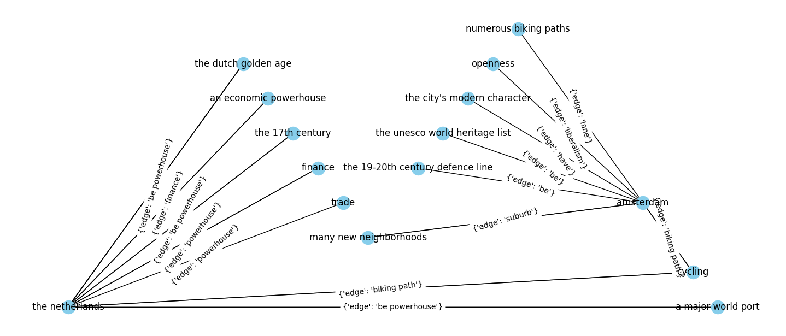

# Havina

Havina is a Python library that can generate knowledge graphs triplets from an input text. Its implementation
is based on the paper "[Language models are open knowledge graphs](https://arxiv.org/abs/2010.11967)" with some
tweaks to improve performance. Most notably, instead of summing the attention scores of each word in a relation,
I am calculating their mean. 

The reasoning behind this change is that a simple sum of scores favors longer relations even if the extra words
do not carry any relevant meaning.

It can be used to evaluate the language comprehension of AI models or as a tool to extract triplets from text 
and build knowledge graphs.

## How to use it

---

After importing the `GraphGenerator` class from havina, simply call the object
with the sentence to evaluate and an optional number of workers. Each worker will span
a different process and the algorithm will split the work between them.

For more information about the constructor parameters, check the (put a ref here!)
Constructor parameters section.

```python
from havina.graph_generator import GraphGenerator

text = 'John Lennon is a famous singer.'
generator = GraphGenerator(
    top_k=4,
    contiguous_token=False
)

triplets = generator(text, workers=1)
print(triplets)
```

The code above will print the following:
```
[
    HeadTailRelations(
        head=Entity(text='john lennon', wikidata_id=None), 
        tail=Entity(text='a famous singer', wikidata_id=None), 
        relations=['be'])
]
```

The returned type is a list of `HeadTailReations` objects, each of which contains
the head and tail entities and the possible relations between them. Relations are
Python strings.

## Example sentence

---

Grabbing the following paragraph from [Wikipedia](https://en.wikipedia.org/wiki/Amsterdam) and using the library as in `example.py`,
we have the following graph. It contains only the relations for the `amsterdam` and the
`the netherlands` nodes to avoid cluttering the image.

> Amsterdam was founded at the mouth of the Amstel River that was dammed to control flooding; the city's name 
> derives from a local linguistic variation of the word dam. Originally a small fishing village in the late 12th 
> century, Amsterdam became a major world port during the Dutch Golden Age of the 17th century, when the Netherlands 
> was an economic powerhouse. Amsterdam was the leading centre for finance and trade, as well as a hub of 
> production of secular art. In the 19th and 20th centuries, the city expanded and many new neighborhoods and 
> suburbs were planned and built. The canals of Amsterdam and the 19-20th century Defence Line of Amsterdam are both 
> on the UNESCO World Heritage List. Sloten, annexed in 1921 by the municipality of Amsterdam, is the oldest part of 
> the city, dating to the 9th century. The city has a long tradition of openness, liberalism, and tolerance. Cycling 
> is key to the city's modern character, and there are numerous biking paths and lanes spread throughout 
> the entire city.



## How it works

---

The last layer of a transformer based language model, like BERT, outputs attention matrices for all its attention heads.
We calculate the average of all the matrices to operate the algorithm. If we are looking for head-tail relationships
with tokens from left to right, we would have a matrix like the following. We disregard
the attention scores from below the diagonal because they represent a word-to-word relationship from right to left. We
utilize such an average of matrices for the beam-search algorithm.

We assume that each attention score represent the probability of two words been related in the sentence.
We show below an example of the beam-search input for the sentence "Joe is curious about cars".

|         | Joe | is  | curious | about | cars |
|---------|-----|-----|---------|-------|------|
| Joe     | X   | 0.1 | 0.4     | 0.2   | 0.3  |
| is      | X   | X   | 0.1     | 0.3   | 0.1  |
| curious | X   | X   | X       | 0.4   | 0.2  |
| about   | X   | X   | X       | X     | 0.4  |
| cars    | X   | X   | X       | X     | X    | 


We utilize spaCy to determine the noun chunks and link them to form head-tail pairs. One possible
head-tail pair for this example would be "(Joe, cars)". Taking "Joe" as the first word, we traverse
the first line of the matrix forming candidate relationships. "is", "curious", "about" are all candidates.

The beam-search only passes for its next iteration the top-k candidates, based on their average attention scores.
If k is one, the only candidate for the second iteration is "curious" with a score of 0.4.

We now traverse the third line in the matrix, looking for possible next tokens given "curious".
"curious about" is the only possibility here because "cars" belongs to the tail chunk. "curious" about
has a score of `(0.4+0.4)/2=0.4`.

The relationship we found for the head-tail pair "(Joe, cars)" is "curious about", so the triplet
looks like `(Joe, curious about, cars)`.

In a later stage, we remove prepositions for the relations and uncapitalize, so the final triplet is `(joe, curious, cars)`.


## Constructor parameters

---

The `GraphGenerator` has many parameters that change the algorithm's behavior. Check the table below to understand
how each of them may affect the results.


| Parameter name | Effect on results | Default value |
|----------------|-------------------|---------------|
| top_k          |                   |               |
|                |                   |               |


## Roadmap

TODOS:

1. Write a readme with description, usage instructions and an example. Add a short description on Github and tags.
2. Publish library on PIP
3. Add language models other than BERT and instructions for other users to user their own models.
4. Use spaCy sentencizer to segment large documents into sentences

